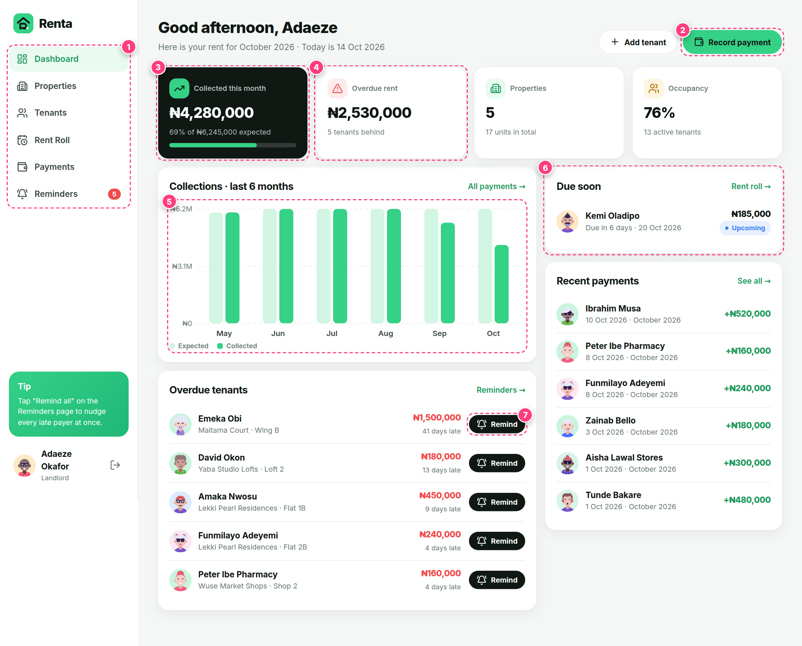

# Renta

Renta is a property and rent manager for landlords. It tracks properties, tenants, rent due dates and payment records, and sends overdue reminders.

**Full documentation with annotated screenshots:** [`docs/Renta-Documentation.pdf`](docs/Renta-Documentation.pdf)



## Features

- **Dashboard**: collected vs expected rent, total overdue, occupancy, a 6-month collections chart, rent due soon and overdue tenants
- **Properties**: cards with cover art, units, occupancy and monthly rent
- **Tenants**: contact details, unit, rent, due day, lease dates, a month-by-month ledger and arrears
- **Rent roll**: every due date and status (Paid / Part-paid / Upcoming / Overdue) for any month
- **Payments**: full or part payments linked to a rent month, an over-payment guard, printable receipts and CSV export
- **Overdue reminders**: personalised WhatsApp / SMS / email messages, a "Remind all" button and reminder history
- Responsive, Bolt-style UI with a bottom tab bar on mobile

## Tech stack

Next.js 16 (App Router, Server Actions) · TypeScript · Drizzle ORM · PostgreSQL · Zod · Lucide icons · DiceBear avatars · Vitest · Playwright · Railway

## Quick start

```bash
npm install
cp .env.example .env            # set DATABASE_URL (docker compose up -d starts a local Postgres)
npm run db:setup                # migrate and load demo data
npm run dev                     # http://localhost:3000
```

Demo login: **demo@renta.app / renta123**

## Scripts

| Command | Description |
| --- | --- |
| `npm run dev` / `build` / `start` | Develop, build and serve |
| `npm run db:generate` | Generate a SQL migration from `src/db/schema.ts` |
| `npm run db:migrate` | Apply migrations |
| `npm run db:seed` | Reset the demo data (`-- --if-empty` seeds only an empty database) |
| `npm test` | Unit and integration tests (needs a `renta_test` database) |
| `npm run test:e2e` | Build, then run the Playwright end-to-end tests (desktop and mobile) |
| `npm run docs:screens` / `docs:pdf` | Retake the annotated screenshots and rebuild the PDF |

Set `RENTA_TODAY=YYYY-MM-DD` to fix "today" to one date, for repeatable demos and tests.

## Project structure

```
src/
  app/            pages (App Router), server actions, API routes
  components/     UI building blocks and client-side forms
  db/             Drizzle schema, client, migrator and seed data
  lib/            rent maths (pure), validation, formatting, session
  services/       portfolio queries and commands (scoped to the landlord)
drizzle/          generated SQL migrations
tests/            Vitest unit and integration tests
e2e/              Playwright tests
docs/             PDF documentation and screenshots
```

## Deploying to Railway

`railway.json` builds with `npm run build` and starts with `npm run start:railway`. On boot this applies migrations, seeds demo data only if the database is empty, then starts Next.js. The health check is `/api/health`.

```bash
npm i -g @railway/cli && railway login
./scripts/deploy-railway.sh     # links "school-projects", adds Postgres, sets variables, deploys
```
